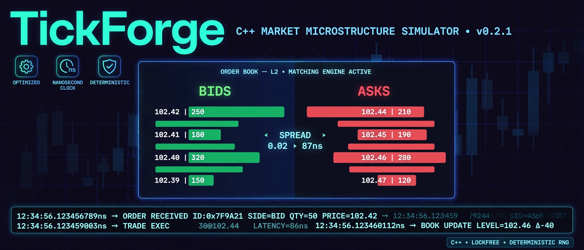
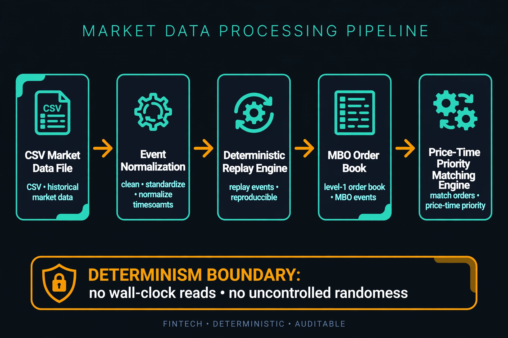

<div align="center">



# TickForge

### Deterministic market microstructure simulator for order-level execution research

[](https://github.com/SachuJames/tickforge/actions/workflows/ci.yml)
[](LICENSE)


Backtesting on bars or aggregated quotes hides the mechanics that decide real
execution quality: where your order sits in the queue, how much quantity is
ahead of it, and exactly which events moved the book before you traded.
TickForge replays historical market activity order by order, with nanosecond
timestamps and a strict determinism guarantee, so execution research is
reproducible down to the individual fill.

[Quickstart](#build) • [Architecture](#architecture) • [Determinism](#determinism-guarantee) • [Spec](SPEC.md)

</div>

---

## What it does

| | |
|---|---|
| 📖 **Market-by-order book** | Full MBO book with price-time priority matching. Every order tracked individually, not aggregated into levels. |
| ⏱️ **Nanosecond replay** | Deterministic event replay with `(timestamp, seq)` ordering. Same input, same output, every time, on any machine. |
| 📊 **Queue position tracking** | Know exactly where a designated order sits: rank and quantity ahead at its price level, through its full lifecycle. |
| 🔢 **Exact execution stats** | Integer-arithmetic fill statistics. Counts, quantities, min/max and volume-weighted average prices with no float drift. |
| 🧪 **Property-based testing** | Deterministic fuzzer with splitmix64 RNG, independent reference model, and sequence minimizer. 10,600+ generated events, zero production defects found. |
| 📁 **CSV ingestion** | One documented CSV format parsed into normalized events, with derived market-state views (best bid/ask, level aggregates). |

## Architecture



TickForge is a layered C++20 system. The replay engine, book, and matching
engine form the deterministic core. See [ARCHITECTURE.md](ARCHITECTURE.md)
for hot/cold path design and [SPEC.md](SPEC.md) for the full specification.

```text
CSV market data → Event normalization → Deterministic replay
  → MBO order book → Price-time priority matching → Execution statistics
```

## Determinism guarantee

The determinism boundary is a hard architectural rule, not a hope:

- **No wall-clock reads** inside the replay/book/matching core
- **No uncontrolled randomness** (seeded splitmix64 where needed)
- **Integer arithmetic** for prices (ticks) and quantities (lots)
- Reproducibility is **asserted by tests**, not assumed (see `test_reproducibility.cpp`)

Run the same event stream twice, on any machine, and every fill is
bit-identical. The [reproducibility audit](SPEC.md) documents exactly what is
and isn't covered.

## Build

Requirements: CMake 3.22+, a C++20 compiler (GCC 11+ or Clang 14+), Git.
GoogleTest is fetched automatically on first configure.

```bash
cmake --preset default
cmake --build --preset default
./build/tickforge
```

Other presets:

```bash
cmake --preset release          # optimized build
cmake --preset asan             # AddressSanitizer + UBSan
ctest --preset asan
```

## Test

```bash
ctest --preset default
# or, from the build directory:
ctest --output-on-failure
```

282 tests across Debug, Release, and ASan+UBSan builds. clang-format clean,
clang-tidy zero warnings. CI runs the full matrix on every push.

## Benchmarking

Per project rule, every performance claim ships with a benchmark and full
methodology (dataset, hardware, compiler, events, runtime, events/sec, median
and p99 latency). See [BENCHMARKING.md](BENCHMARKING.md). There are no
performance claims without a published benchmark.

## Project layout

```
tickforge/
├── src/
│   ├── tickforge_event/       # Normalized event model (ticks, lots, seq)
│   ├── tickforge_book/        # Market-by-order book
│   ├── tickforge_matching/    # Price-time priority matching engine
│   ├── tickforge_replay/      # Deterministic replay driver
│   ├── tickforge_analytics/   # Queue position + execution statistics
│   └── tickforge_market_data/ # CSV parsing boundary
├── tests/
│   ├── test_reproducibility.cpp
│   └── support/               # Property-testing framework (RNG, minimizer)
├── SPEC.md                    # Full specification
├── ARCHITECTURE.md            # Design and determinism boundary
└── BENCHMARKING.md            # Benchmark methodology
```

## Contributing

See [CONTRIBUTING.md](CONTRIBUTING.md). Bug reports and design discussion are
welcome via GitHub issues.

## Security

See [SECURITY.md](SECURITY.md) for the vulnerability reporting policy.

## License

MIT. See [LICENSE](LICENSE).
